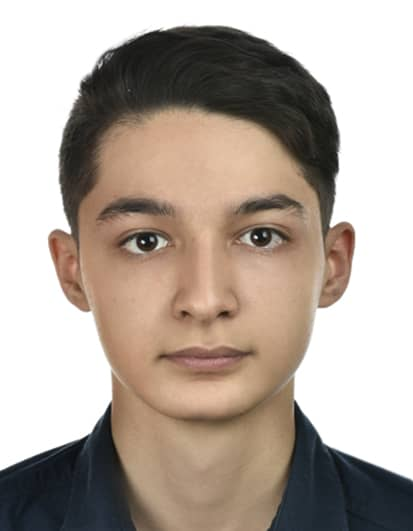
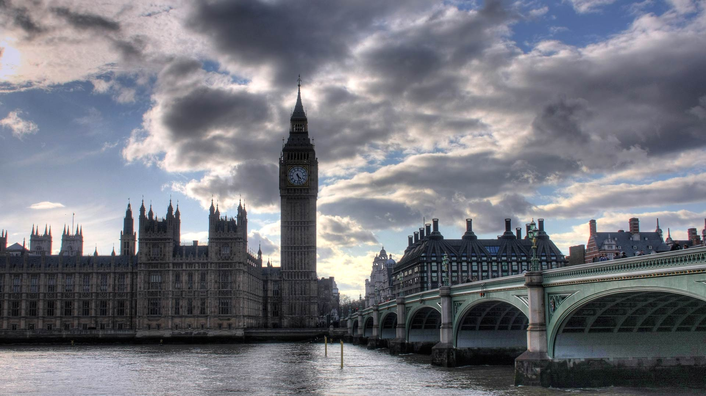
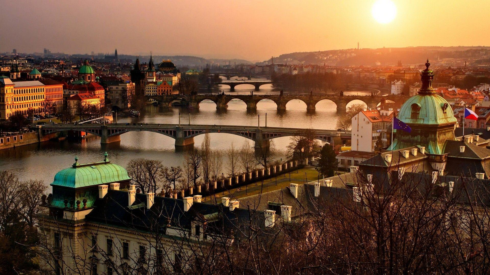

<h1 id = "beginning">i am KAMYAR MORADIAN</h1>

hey every one my name is<b> kamyar moradian</b>, and this is web page about me and other stuff that i want to share with you 
   you can see everything in the list below

 
 ---

+ <a href = "#Edu"><strong>Life and Education</strong></a> 
+ <a href = "#Interest"><strong>Interests</strong></a>
+ <a href = "#Goals"><strong>Goals</strong></a>
+ <a href = "#Images"><strong>Images</strong></a>
+ <a href = "#Contact"><strong>Contact</strong></a>

---

<h3>Life and Education</h3>

    i am 18 years old and i was born in Mashhad-Iran and actually now i am studying in the field of Computer Engineering in <a href = "http://www.iust.ac.ir/en" title = "URL of My Uni WebSite">Elm-o-San'at University(University of Science and Technology of Iran)</a> and i am still undergraduate. so, i actually don't have much to say in this case except that my konkoor rank was 491 of manteghe yek(i don't know english meaning &#128578) and i studied in Ario mosalla nejad highschool in Mashhad.
    i don't have much more to add to this field except that my english education is at the intermedate level &#128578.

---
### Interests

    Well obviously according to previous section my main interest and hobby is to work with computer and program or even to learn different programming languages. i actually spend most of my time doing it. 
    next thing that i mostly do is surfing the internet and searching for different things in social media, which i think is the main hobby of people noawdays. 
    hanging out with my friends is my next hobby. actually miss the days i used to hang out with them for most of the time. now i don't regurally. 
    another one is watching movies. after the covid-19 pandemic and several lockdown it's been one of my main interests.

---

### Goals

Before i begin to start sharing my goals with you, i should tell you that you need to <b>keep your goals as a secret to yourself</b> and hide it in the public so i'm going to talk about them in general. 
First,i'd rather to shine with experience and skilles than the things you learn in university. I mean <b>don't stick just to things you learn in the university</b> go and try and comprehend them by yourself. 
Second,if you want to be your targets be straight in your road,see yourself in next 5 years that you desire.Thinking about past its better to say killing your time is one of the worst habit that can happen to anyone. so keep your mind in a specific way that makes you the best version of yourself. 
however i told you it's better to keep your goals as secrest, but one of my goals which i prefer to say one of my <b>dreams</b> is to go around the world and see how other places look like-images are in the image section. 
<strong>Sum up,the one can change you and makes you the real one is you because the one that know you is just you yourself so use other recommendation to shape a way to reach your goals as soon as its possible but be patient.</strong>

### Images

_Now it's time to see some images. first one is an image from me._ &#128578

            

--- 

_and i just added some images there of places that i'd like to visit someday._

**Paris**
                                                                     

                                                                    

**London**
                                                                     
----
                                                                     

**Tokyo**
                                                                     
----
                                                                     

**Prague**
                                                                     

<h3>Cotact Me</h3>

                                                                     

And finally i want to put my gmails and my telegram id here. and i'll be happy if you contact me: 
My Gmail: kamyarmorad1381@gmail.com 
          kamyar_moradian@comp.iust.ac.ir 
My Telegram Id: @kami_2002 

   

